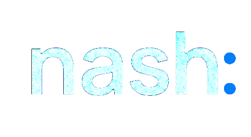

  

  An AI chat platform that makes every teammate better. Powered by <a href="https://backboard.io">Backboard.io</a>.

---

# Features

- **AI Model Selection**:
  - Anthropic (Claude), AWS Bedrock, OpenAI, Azure OpenAI, Google, Vertex AI, OpenAI Responses API (incl. Azure)
  - Custom Endpoints: Use any OpenAI-compatible API, no proxy required
  - Compatible with Local & Remote AI Providers:
    - Ollama, groq, Cohere, Mistral AI, Apple MLX, koboldcpp, together.ai,
    - OpenRouter, Helicone, Perplexity, ShuttleAI, Deepseek, Qwen, and more

- **Code Interpreter API**:
  - Secure, Sandboxed Execution in Python, Node.js (JS/TS), Go, C/C++, Java, PHP, Rust, and Fortran
  - Seamless File Handling: Upload, process, and download files directly
  - Fully isolated and secure execution

- **Agents & Tools Integration**:
  - No-Code Custom Assistants: Build specialized, AI-driven helpers
  - Agent Marketplace: Discover and deploy community-built agents
  - Collaborative Sharing: Share agents with specific users and groups
  - Flexible & Extensible: Use MCP Servers, tools, file search, code execution, and more
  - [Model Context Protocol (MCP)](https://modelcontextprotocol.io) Support for Tools

- **Web Search**:
  - Search the internet and retrieve relevant information to enhance your AI context
  - Combines search providers, content scrapers, and result rerankers for optimal results

- **Generative UI with Code Artifacts**:
  - Code Artifacts allow creation of React, HTML, and Mermaid diagrams directly in chat

- **Image Generation & Editing**:
  - Text-to-image and image-to-image with GPT-Image-1, DALL-E, Stable Diffusion, Flux, or any MCP server

- **Presets & Context Management**:
  - Create, Save, & Share Custom Presets
  - Switch between AI Endpoints and Presets mid-chat
  - Edit, Resubmit, and Continue Messages with Conversation branching
  - Fork Messages & Conversations for Advanced Context control

- **Multimodal & File Interactions**:
  - Upload and analyze images with Claude 3, GPT-4.5, GPT-4o, o1, Llama-Vision, and Gemini
  - Chat with Files using Custom Endpoints, OpenAI, Azure, Anthropic, AWS Bedrock, & Google

- **Multilingual UI**:
  - English, 中文 (简体), 中文 (繁體), العربية, Deutsch, Español, Français, Italiano
  - Polski, Português (PT), Português (BR), Русский, 日本語, Svenska, 한국어, Tiếng Việt
  - And many more

- **Reasoning UI**: Dynamic Reasoning UI for Chain-of-Thought/Reasoning AI models like DeepSeek-R1

- **Resumable Streams**: AI responses automatically reconnect and resume if your connection drops

- **Speech & Audio**: Chat hands-free with Speech-to-Text and Text-to-Speech

- **Import & Export Conversations**: Import from LibreChat, ChatGPT, Chatbot UI; export as screenshots, markdown, text, json

- **Multi-User & Secure Access**: OAuth2, LDAP, & Email Login with built-in moderation

- **Configuration & Deployment**: Docker, Proxy, Reverse Proxy, and many deployment options

---

## All-In-One AI Conversations with Nash

Nash is a self-hosted AI chat platform that unifies all major AI providers in a single, privacy-focused interface.

Beyond chat, Nash provides AI Agents, Model Context Protocol (MCP) support, Artifacts, Code Interpreter, custom actions, conversation search, and enterprise-ready multi-user authentication.

Open source, actively developed, and built for anyone who values control over their AI infrastructure.

Based on [LibreChat](https://github.com/danny-avila/LibreChat) by Danny Avila.

---

## Resources

- **Website:** [nash.backboard.io](https://nash.backboard.io)
- **Backboard:** [backboard.io](https://backboard.io)
- **Upstream:** [LibreChat](https://github.com/danny-avila/LibreChat)
